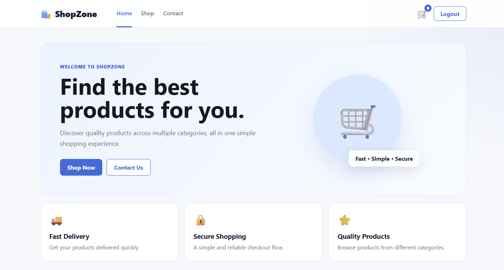
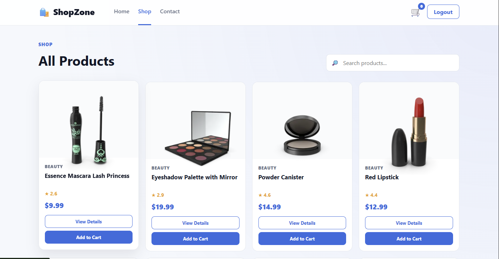
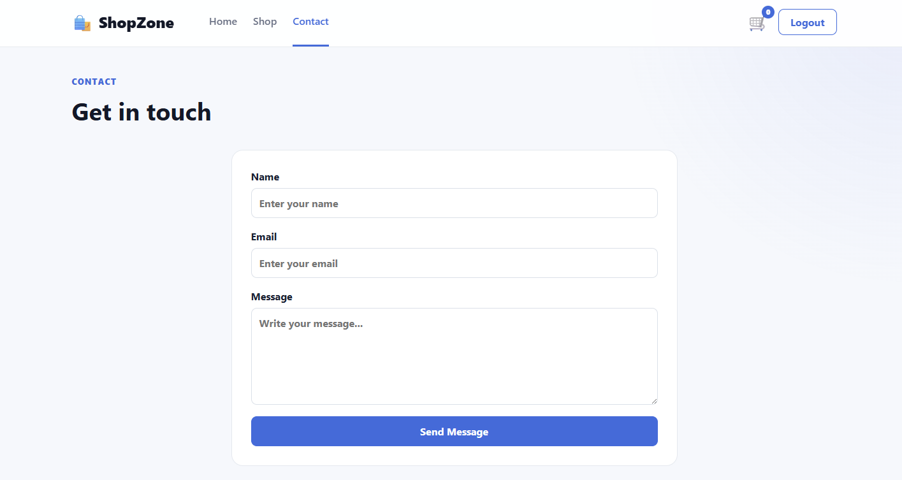

# 🛍️ ShopZone

ShopZone is a modern **e-commerce web application** built using **React.js**. It provides users with a simple and responsive shopping experience where they can browse products, search and filter products, view product details, manage their cart, and proceed through the checkout flow.

The project focuses on building a clean React-based frontend while practicing concepts such as **components, React Router, state management, API integration, forms, reusable UI components, and responsive design**.

---

## 🚀 Features

* 🏠 Modern and responsive homepage
* 🔍 Product search functionality
* 🗂️ Product browsing and filtering
* 📦 Product details page
* 🛒 Add products to cart
* ➕ Increase/decrease product quantity
* 🗑️ Remove products from cart
* 💰 Automatic cart total calculation
* 🔐 Login/Register UI
* 💳 Checkout page
* 📱 Responsive design for different screen sizes
* ⏳ Loading states
* ⚠️ Error handling and empty states
* 📄 Multiple pages using React Router
* ♻️ Reusable React components

---

## 📸 Screenshots






---

## Links

Live:- https://the-shop-three-mu.vercel.app/

Video:- 

---

## 🛠️ Technologies Used

### Frontend

* **React.js**
* **JavaScript (ES6+)**
* **HTML5**
* **CSS3**
* **React Router**
* **Vite**


## 📂 Project Structure

```text
ShopZone/
│
├── public/
│
├── src/
│   ├── assets/
│   │
│   ├── components/
│   │   ├── Navbar.jsx
│   │   ├── Footer.jsx
│   │   ├── ProductCard.jsx
│   │   └── ...
│   │
│   ├── pages/
│   │   ├── Home.jsx
│   │   ├── Shop.jsx
│   │   ├── ProductDetails.jsx
│   │   ├── Cart.jsx
│   │   ├── Checkout.jsx
│   │   ├── Login.jsx
│   │   ├── Register.jsx
│   │   ├── Contact.jsx
│   │   └── NotFound.jsx
│   │
│   ├── App.jsx
│   ├── main.jsx
│   └── index.css
│
├── package.json
├── package-lock.json
└── prompts.md
└── README.md
```


---

## 🖥️ Application Pages

### 🏠 Home

The homepage introduces ShopZone and provides access to featured products and shopping sections.

### 🛍️ Shop

Users can browse available products and search/filter products according to their requirements.

### 📦 Product Details

Users can open an individual product to view its detailed information before adding it to the cart.

### 🛒 Cart

The cart allows users to:

* View selected products
* Change quantities
* Remove products
* View the total amount

### 💳 Checkout

The checkout page provides a basic checkout flow where users can enter the required information before completing the purchase.

### 🔐 Authentication

The project includes Login and Registration interfaces for handling the user authentication flow on the frontend.

### 📞 Contact

A contact page provides a form through which users can submit their information and message.

### ❌ 404 Page

A custom Not Found page is displayed when the user navigates to an invalid route.

---

## 🧠 React Concepts Practiced

This project was created to practice and understand important React concepts, including:

* Functional Components
* JSX
* Props
* State Management
* `useState`
* `useEffect`
* Event Handling
* Conditional Rendering
* Lists and `.map()`
* Array Filtering
* API Integration
* React Router
* Reusable Components
* Form Handling
* Component-based Architecture

---

## 🎯 Project Goals

The main goals of ShopZone are:

1. Build a complete frontend e-commerce interface using React.
2. Understand component-based development.
3. Practice working with APIs.
4. Implement client-side routing.
5. Manage shopping cart data and user interactions.
6. Create reusable UI components.
7. Build a responsive and user-friendly interface.
8. Improve understanding of real-world React project structure.

---

## 🔮 Future Improvements

The project can be further enhanced by adding:

* 🔐 Real user authentication
* 💳 Real payment gateway integration
* ❤️ Wishlist functionality
* 📦 Order history
* 👤 User profile management
* 🗄️ Backend integration
* 🛢️ Database integration
* 🔔 Order notifications
* ⭐ Product reviews and ratings
* 🧑‍💼 Admin dashboard
* 📊 Product and order management

---


## 📚 Learning Outcome

Through this project, I gained practical experience in developing a React-based application and learned how different parts of a frontend application work together.

The project helped me understand:

* How React components communicate
* How data is fetched from an API
* How routing works in a single-page application
* How to manage cart-related state
* How to create reusable components
* How to handle loading and error states
* How to structure a React project
* How to make a frontend application responsive

